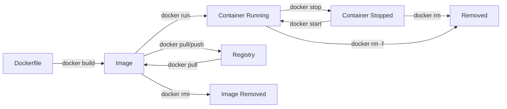
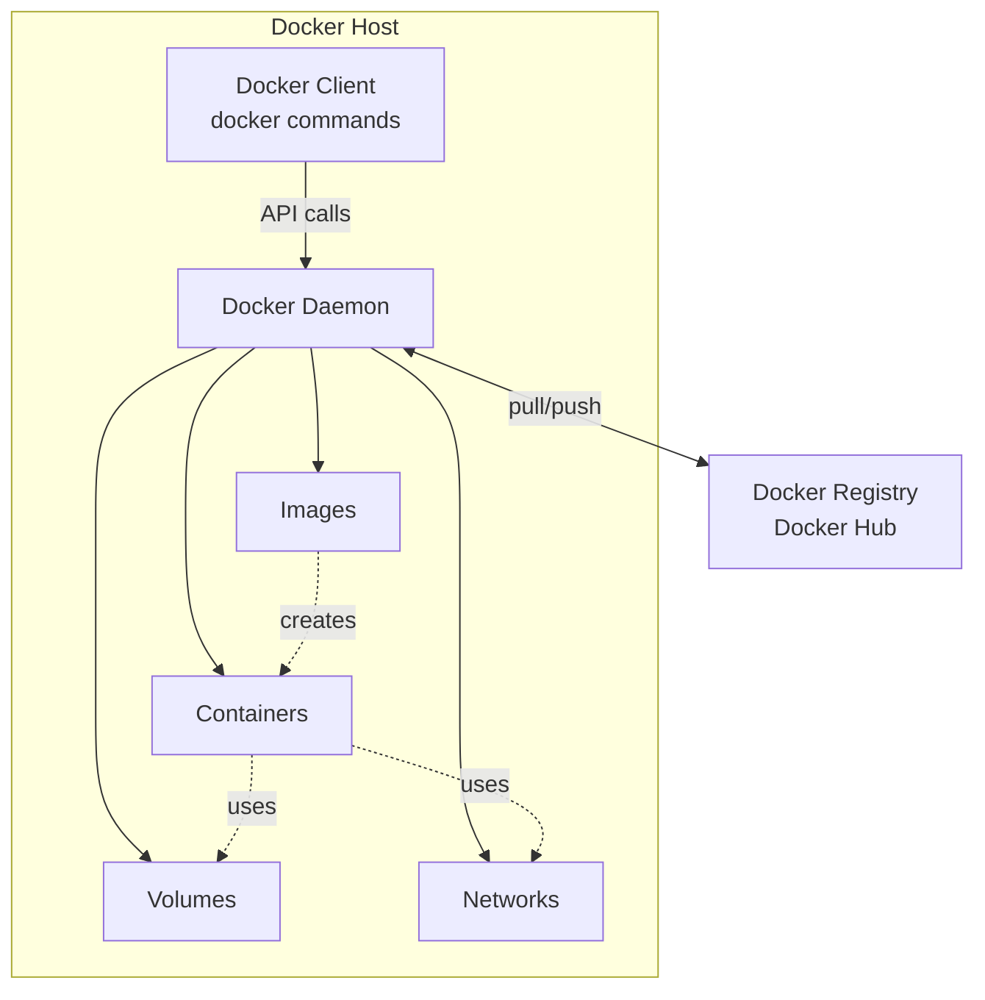
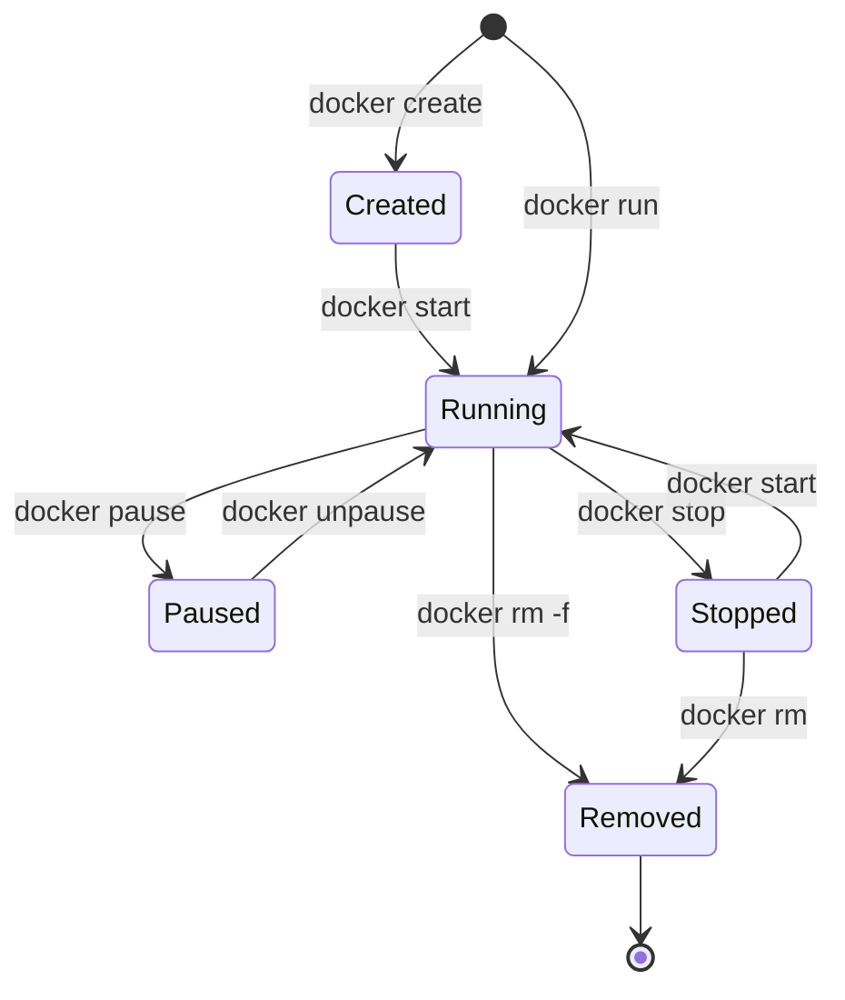
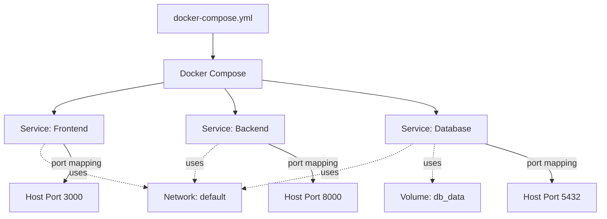

# 🐳 Docker Cheat Sheet

Quick reference guide for the most important Docker commands.

---

## 📋 Table of Contents

- [Container Commands](#-container-commands)
- [Image Commands](#-image-commands)
- [Docker Compose Commands](#-docker-compose-commands)
- [Docker Lifecycle](#-docker-lifecycle-diagram)
- [Networking & Volumes](#-networking--volumes)
- [Useful Tips](#-useful-tips)

---

## 🚀 Container Commands

### Starting & Stopping

```bash
# Run a container from an image
docker run <image>

# Run container in detached mode (background)
docker run -d <image>

# Run container with port mapping
docker run -p <host-port>:<container-port> <image>

# Run container with environment variables
docker run -e KEY=value <image>

# Run container with name
docker run --name my-container <image>

# Run container with volume mount
docker run -v /host/path:/container/path <image>

# Complete example
docker run -d --name my-app -p 8080:80 -e ENV=prod nginx

# Stop a running container
docker stop <container-id|name>

# Start a stopped container
docker start <container-id|name>

# Restart a container
docker restart <container-id|name>

# Pause a container
docker pause <container-id|name>

# Unpause a container
docker unpause <container-id|name>
```

### Viewing & Inspecting

```bash
# List running containers
docker ps

# List all containers (including stopped)
docker ps -a

# View container logs
docker logs <container-id|name>

# Follow logs in real-time
docker logs -f <container-id|name>

# Show last N lines of logs
docker logs --tail 100 <container-id|name>

# Inspect container details (JSON format)
docker inspect <container-id|name>

# View container resource usage
docker stats

# View processes running in container
docker top <container-id|name>
```

### Executing Commands

```bash
# Execute command in running container
docker exec <container-id|name> <command>

# Open interactive shell in container
docker exec -it <container-id|name> bash

# Open shell as root user
docker exec -it -u root <container-id|name> bash

# Execute one-off command
docker exec <container-id|name> ls /app
```

### Removing Containers

```bash
# Remove a stopped container
docker rm <container-id|name>

# Force remove a running container
docker rm -f <container-id|name>

# Remove all stopped containers
docker container prune

# Remove all containers (stopped and running)
docker rm -f $(docker ps -aq)
```

---

## 📦 Image Commands

### Building Images

```bash
# Build image from Dockerfile in current directory
docker build .

# Build image with a tag
docker build -t my-app:latest .

# Build image with specific Dockerfile
docker build -f Dockerfile.prod -t my-app:prod .

# Build without using cache
docker build --no-cache -t my-app .

# Build with build arguments
docker build --build-arg VERSION=1.0 -t my-app .
```

### Managing Images

```bash
# List all images
docker images

# List images with more details
docker images -a

# Pull image from registry
docker pull <image>:<tag>

# Pull specific version
docker pull nginx:1.25

# Tag an image
docker tag <source-image> <target-image>

# Example: Tag for Docker Hub
docker tag my-app:latest username/my-app:v1.0

# Push image to registry
docker push username/my-app:v1.0

# Remove an image
docker rmi <image-id|name>

# Force remove an image
docker rmi -f <image-id|name>

# Remove unused images
docker image prune

# Remove all unused images (not just dangling)
docker image prune -a

# View image history (layers)
docker history <image>

# Inspect image details
docker inspect <image>
```

### Searching Images

```bash
# Search Docker Hub for images
docker search nginx

# Search with filter (min 100 stars)
docker search --filter stars=100 nginx
```

---

## 🎼 Docker Compose Commands

### Basic Operations

```bash
# Start all services (builds if needed)
docker compose up

# Start in detached mode
docker compose up -d

# Force rebuild and start
docker compose up --build

# Rebuild without starting
docker compose build

# Rebuild specific service
docker compose build backend

# Stop all services (keeps containers)
docker compose stop

# Stop and remove containers
docker compose down

# Stop and remove containers, volumes
docker compose down -v

# Stop and remove containers, images
docker compose down --rmi all
```

### Viewing & Monitoring

```bash
# List running services
docker compose ps

# List all services (including stopped)
docker compose ps -a

# View logs for all services
docker compose logs

# Follow logs in real-time
docker compose logs -f

# View logs for specific service
docker compose logs backend

# Follow specific service logs
docker compose logs -f backend

# View service resource usage
docker compose stats
```

### Service Management

```bash
# Start specific service
docker compose start backend

# Stop specific service
docker compose stop backend

# Restart specific service
docker compose restart backend

# Restart all services
docker compose restart

# Execute command in service
docker compose exec backend bash

# Run one-off command in new container
docker compose run backend python manage.py migrate

# Scale service to multiple instances
docker compose up -d --scale backend=3
```

### Validation & Info

```bash
# Validate docker-compose.yml syntax
docker compose config

# View configuration with resolved values
docker compose config --services

# List images used by services
docker compose images

# View service ports
docker compose port backend 8000
```

---

## 🔄 Docker Lifecycle Diagram



## 🏗️ Docker Architecture



## 🔄 Container States



## 📁 Docker Compose Architecture



---

## 🌐 Networking & Volumes

### Networks

```bash
# List networks
docker network ls

# Create network
docker network create my-network

# Connect container to network
docker network connect my-network my-container

# Disconnect container from network
docker network disconnect my-network my-container

# Remove network
docker network rm my-network

# Remove all unused networks
docker network prune

# Inspect network details
docker network inspect my-network
```

### Volumes

```bash
# List volumes
docker volume ls

# Create volume
docker volume create my-volume

# Remove volume
docker volume rm my-volume

# Remove all unused volumes
docker volume prune

# Inspect volume details
docker volume inspect my-volume

# Use volume in container
docker run -v my-volume:/data my-app
```

---

## 💡 Useful Tips

### Cleanup Commands

```bash
# Remove all stopped containers
docker container prune

# Remove all unused images
docker image prune -a

# Remove all unused volumes
docker volume prune

# Remove all unused networks
docker network prune

# Nuclear option: Clean everything
docker system prune -a --volumes
```

### Monitoring & Debugging

```bash
# View Docker disk usage
docker system df

# Stream container events
docker events

# View detailed container info
docker inspect <container> | grep -i <keyword>

# Copy files from container to host
docker cp <container>:/path/to/file ./local-path

# Copy files from host to container
docker cp ./local-file <container>:/path/to/destination

# Export container filesystem as tar
docker export <container> > container.tar

# Save image as tar file
docker save -o image.tar <image>

# Load image from tar file
docker load -i image.tar
```

### Common Patterns

```bash
# Run temporary container (auto-remove when stopped)
docker run --rm <image>

# Run with interactive terminal
docker run -it <image> /bin/bash

# Run with hostname
docker run --hostname my-host <image>

# Run with resource limits
docker run -m 512m --cpus 1 <image>

# Run with restart policy
docker run --restart unless-stopped <image>

# View container IP address
docker inspect -f '{{range.NetworkSettings.Networks}}{{.IPAddress}}{{end}}' <container>
```

---

## 🎯 Quick Reference Table

| Task | Command |
|------|---------|
| Run container | `docker run -d -p 8080:80 --name web nginx` |
| Stop container | `docker stop web` |
| Remove container | `docker rm web` |
| View logs | `docker logs -f web` |
| Execute shell | `docker exec -it web bash` |
| Build image | `docker build -t myapp:v1 .` |
| List containers | `docker ps -a` |
| List images | `docker images` |
| Compose up | `docker compose up -d` |
| Compose down | `docker compose down` |
| Compose logs | `docker compose logs -f` |
| Clean everything | `docker system prune -a --volumes` |

---

## 🔍 Common Flags Explained

| Flag | Description | Example |
|------|-------------|---------|
| `-d` | Detached mode (background) | `docker run -d nginx` |
| `-it` | Interactive terminal | `docker run -it ubuntu bash` |
| `-p` | Port mapping (host:container) | `docker run -p 8080:80 nginx` |
| `-v` | Volume mount | `docker run -v /data:/app/data nginx` |
| `-e` | Environment variable | `docker run -e DB_HOST=localhost nginx` |
| `--name` | Container name | `docker run --name web nginx` |
| `--rm` | Auto-remove when stopped | `docker run --rm nginx` |
| `-f` | Force operation | `docker rm -f container` |
| `-a` | All items (including stopped) | `docker ps -a` |
| `--build` | Rebuild images | `docker compose up --build` |

---

**Pro Tip**: Use `docker --help` or `docker <command> --help` for detailed information about any command!

**Built for the Docker Workshop** 🚀
